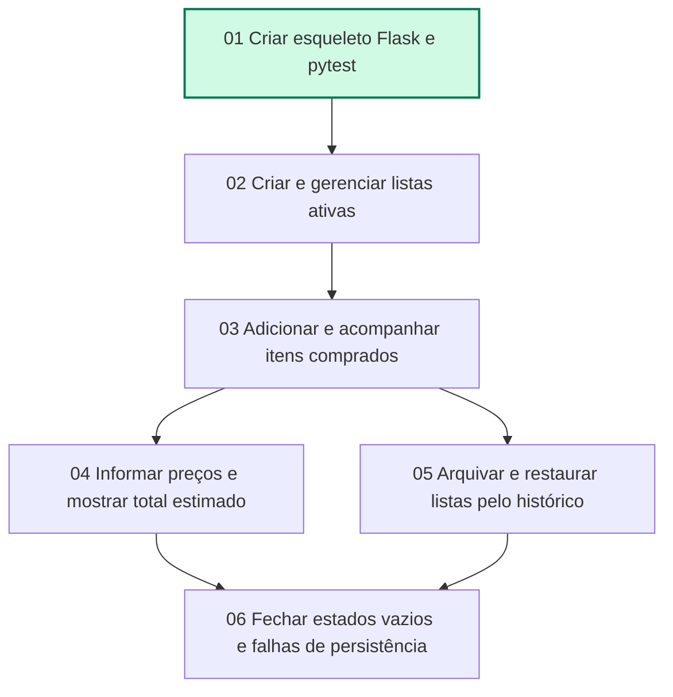

# DAG de implementação

```mermaid
graph TD
    N01["01 Criar esqueleto Flask e pytest"] --> N02["02 Criar e gerenciar listas ativas"]
    N02 --> N03["03 Adicionar e acompanhar itens comprados"]
    N03 --> N04["04 Informar preços e mostrar total estimado"]
    N03 --> N05["05 Arquivar e restaurar listas pelo histórico"]
    N04 --> N06["06 Fechar estados vazios e falhas de persistência"]
    N05 --> N06

    classDef fronteira fill:#d1fae5,stroke:#047857,stroke-width:2px
    class N01 fronteira
```

O grafo é acíclico. A fronteira inicial contém apenas o ticket 01, que não possui bloqueios em aberto.
